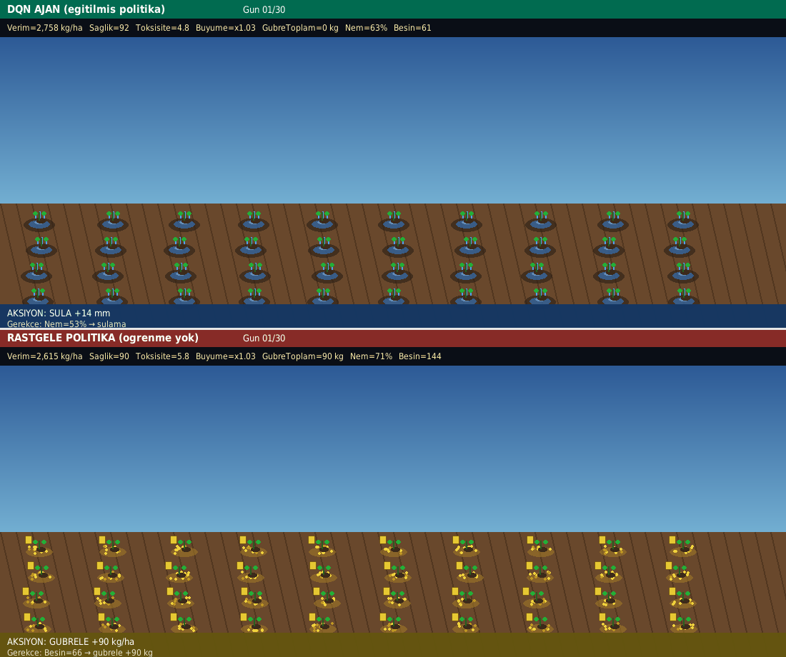
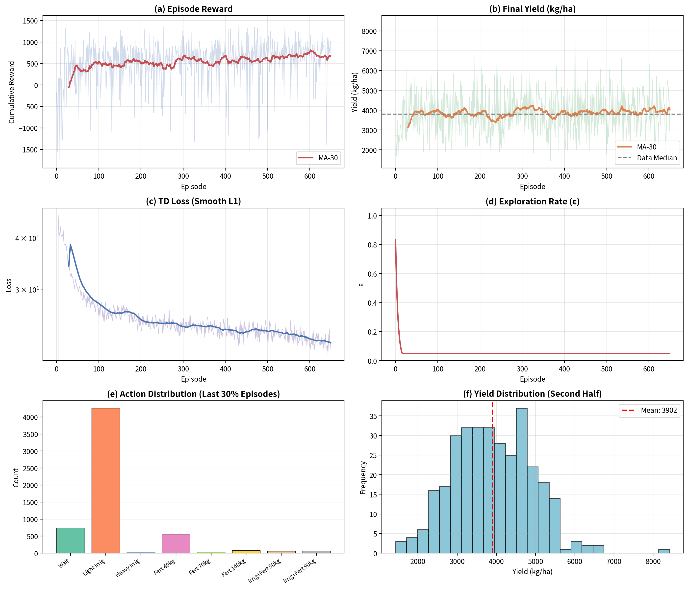

# Akıllı Tarım Yönetimi için Derin Pekiştirmeli Öğrenme: DQN Tabanlı Karar Destek Sistemi

> **Yüksek Lisans — Derin Pekiştirmeli Öğrenme Dersi Proje Ödevi**  
> Tabular Q-Learning yaklaşımının Deep Q-Network (DQN) ve gerçek veri kalibrasyonu ile genişletilmesi

---

## Özet

Çalışmada, tarımsal üretimde sulama ve gübreleme kararlarını optimize etmek amacıyla **Deep Q-Network (DQN)** tabanlı bir pekiştirmeli öğrenme sistemi geliştirilmiştir. Geliştirilen ajan, 30 günlük bir yetiştirme sezonunda her gün toprak ve bitki durumunu gözlemleyerek sulama, gübreleme veya bekleme kararı almakta; sezon sonunda hasat verimini maksimize etmeyi, gübre kullanımını gerçek tarımsal veri dağılımına yakın tutmayı ve toprak toksisitesini kontrol altında tutmayı hedeflemektedir.

Önceki tabular Q-Learning projesinden farklı olarak durum uzayı sürekli sensör değişkenlerinden oluşmakta, değer fonksiyonu bir sinir ağı ile yaklaşıklaştırılmakta ve ortam parametreleri gerçek bir ürün verim veri setinden kalibre edilmektedir. Eğitilmiş politika, aynı ortamda çalışan rastgele bir politikaya karşı hem sayısal metriklerle hem de yan yana tarla simülasyonu ile karşılaştırılmıştır.

### DQN vs Rastgele Politika (Özet Görsel)

Aynı ortamda eğitilmiş DQN ajanı (üst) ile rastgele politika (alt) yan yana çalıştırılmıştır. DQN ölçülü sulama ve gübreleme ile verimi korurken; rastgele politika aşırı gübreleyerek toksisite biriktirir ve verimi düşürür.



| Metrik | DQN | Rastgele |
|--------|-----|----------|
| Verim | ~3500+ kg/ha | ~1800 kg/ha |
| Sezon gübre | ~120 kg/ha | ~2000+ kg/ha |
| Toksisite | Kontrollü | Yüksek |
| Sağlık | Korunur | Sıfıra iner |

---

## İçindekiler

1. [Giriş](#1-giriş)
2. [Problemin Tanımı](#2-problemin-tanımı)
3. [Yöntem](#3-yöntem)
4. [Sistem Mimarisi](#4-sistem-mimarisi)
5. [Deney Düzeneği](#5-deney-düzeneği)
6. [Deneysel Sonuçlar](#6-deneysel-sonuçlar)
7. [Karşılaştırmalı Analiz](#7-karşılaştırmalı-analiz)
8. [Tartışma](#8-tartışma)
9. [Sonuç](#9-sonuç)
10. [Kurulum ve Çalıştırma](#10-kurulum-ve-çalıştırma)
11. [Proje Yapısı](#11-proje-yapısı)

---

## 1. Giriş

Tarımsal üretimde su ve kimyasal gübre yönetimi, hem çiftçi gelirini hem de çevresel sürdürülebilirliği doğrudan etkileyen kritik operasyonel kararlardır. Aşırı gübreleme üretim maliyetini yükseltir, toprak yapısını bozar ve yüzey ile yeraltı sularının kirlenmesine yol açar. Yetersiz sulama veya gübreleme ise bitki gelişimini engelleyerek verim kaybına neden olur. Bu kararlar doğası gereği sıralıdır: bugün verilen bir gübre dozu ertesi günlerin besin durumunu, toksisite birikimini ve nihai hasadı etkiler.

Geleneksel uygulamalarda bu kararlar çoğunlukla çiftçinin deneyimine ve sezgisine bırakılır. Pekiştirmeli öğrenme (Reinforcement Learning), sıralı karar verme problemleri için biçimsel bir çerçeve sunduğundan, tarımsal yönetim bu yöntemler için doğal bir uygulama alanıdır. Önceki ders projesinde tabular **Q-Learning** ile ayrık durum uzayında (yaklaşık 11.250 durum) sulama ve gübreleme politikası öğrenilmiştir. Ancak gerçek tarla sensörleri sürekli değer ürettiği için tabular yaklaşım boyutlanabilirlik sorunu yaşamaktadır.

Bu çalışmada sistem üç yönde genişletilmiştir:

1. Tabular Q-Learning yerine **Deep Q-Network (DQN)** kullanılarak sürekli durum uzayına geçilmiştir.
2. Ortam, **gerçek ürün verim ve gübre istatistikleri** ile kalibre edilmiştir; böylece taban verim ve gübre aralıkları tamamen sentetik varsayımlara dayanmamaktadır.
3. Günlük bitki büyümesi, FAO AquaCrop ve klasik verim-tepki faktörü literatüründen esinlenen çarpanlı stres modeli ile tanımlanmıştır.

Amaç; hasat verimini artıran, gübre kullanımını gerçekçi seviyede tutan ve toksisiteyi sınırlayan bir politikanın öğrenilebilir olduğunu göstermektir.

---

## 2. Problemin Tanımı

### 2.1 Markov Karar Süreci (MDP) Formülasyonu

Otuz günlük ürün döngüsü sonlu ufuklu bir **Markov Karar Süreci** olarak modellenmiştir. Her gün ajan mevcut durumu gözlemler, bir aksiyon seçer, ortam yeni duruma geçer ve skaler bir ödül üretir. Amaç, iskonto edilmiş toplam ödülü maksimize eden politikayı öğrenmektir.

| Bileşen | Tanım |
|---------|-------|
| **Durum Uzayı (S)** | 9 boyutlu sürekli durum vektörü |
| **Aksiyon Uzayı (A)** | 8 ayrık yönetim kararı |
| **Geçiş Fonksiyonu (T)** | Stokastik süreç + stres tabanlı büyüme |
| **Ödül Fonksiyonu (R)** | Çok bileşenli şekillendirilmiş ödül |
| **İndirim Faktörü (γ)** | 0.97 |

### 2.2 Durum Uzayı

Durum, tipik IoT toprak ve hava sensörlerinden elde edilebilecek sürekli ölçümlerle tanımlanmıştır. Bu sayede ajanın girdi temsili, ayrıklaştırılmış tabular durumlara kıyasla gerçekçi sensör akışına daha yakındır.

| Boyut | Açıklama |
|-------|----------|
| `day` | Normalize gün indeksi \(t/30\) |
| `moisture` | Toprak nemi (%) |
| `nutrient` | Göreli besin seviyesi |
| `pH` | Toprak asitliği |
| `temperature` | Sıcaklık (°C) |
| `humidity` | Bağıl nem (%) |
| `light` | Işık şiddeti |
| `health` | Bitki sağlığı (0–100) |
| `toxicity` | Toksisite indeksi |

### 2.3 Aksiyon Uzayı

Aksiyonlar, gerçek tarımsal uygulamalarda görülen sulama hacimleri ve gübre dozlarını temsil edecek şekilde seçilmiştir. Özellikle gübre miktarları, kalibrasyon veri setindeki `Fertilizer_per_ha` dağılımının medyan ve çeyrekliklerine hizalanmıştır (medyan ≈ 137 kg/ha). Böylece ajanın seçebileceği dozlar, veri dışı aşırı değerlere kaymamaktadır.

| ID | Aksiyon | Su (mm) | Gübre (kg/ha) |
|----|---------|---------|----------------|
| 0 | Bekle | 0 | 0 |
| 1 | Hafif Sulama | 14 | 0 |
| 2 | Yoğun Sulama | 28 | 0 |
| 3 | Gübre 40 kg | 0 | 40 |
| 4 | Gübre 70 kg | 0 | 70 |
| 5 | Gübre 140 kg | 0 | 140 |
| 6 | Sulama + Gübre 50 kg | 16 | 50 |
| 7 | Sulama + Gübre 90 kg | 18 | 90 |

### 2.4 Geçiş Dinamikleri ve Büyüme Modeli

Aksiyon uygulandıktan sonra nem, besin ve toksisite güncellenir. Ardından su, besin ve toksisite stresleri hesaplanır. Günlük göreli büyüme, literatürdeki çarpanlı stres formuna uygundur:

\[
g_t = g_0 \cdot (1-k_w\sigma_w)\cdot(1-k_n\sigma_n)\cdot(1-k_\tau\sigma_\tau)
\]

Kümülatif büyüme ve toksisite cezası birlikte nihai verimi belirler. Taban verim \(Y_{\mathrm{base}}\) her bölümün başında gerçek veri dağılımından örneklenir; böylece model çıktıları ampirik verim aralığı ile tutarlı kalır.

### 2.5 Ödül Fonksiyonu

Ödül, yalnızca dönem sonu verime bakmak yerine ara adımlarda da yol gösterici sinyal üretecek şekilde şekillendirilmiştir. Aşırı gübrelemeyi bastırmak için toksisite cezası, gerçekçi toplam gübre kullanımını teşvik etmek için sezonluk gübre bandı bonusu eklenmiştir.

| Bileşen | Açıklama |
|---------|----------|
| Sağlık terimi | Bitki sağlığındaki iyileşme ödüllendirilir |
| Nem / besin bandı | Değişkenler ideal aralıkta iken bonus verilir |
| Besin eksikliği | Besin çok düşükse ceza uygulanır (gübrelemeye teşvik) |
| Toksisite | Yüksek toksisite güçlü biçimde cezalandırılır |
| Aksiyon maliyeti | Gereksiz kaynak kullanımı hafif cezalandırılır |
| Dönem sonu verim | Yüksek hasat ödüllendirilir |
| Sezon gübre bandı | Toplam gübrenin gerçekçi aralıkta olması ekstra ödül getirir |

---

## 3. Yöntem

### 3.1 Deep Q-Network (DQN)

DQN, model-free bir değer tabanlı derin pekiştirmeli öğrenme algoritmasıdır. Eylem-değer fonksiyonu \(Q(s,a;\theta)\) çok katmanlı bir sinir ağı ile yaklaşıklaştırılır. Eğitim sırasında ağ, deneyim tekrarı tamponundan örneklenen geçişler üzerinde şu hedefe yaklaştırılır:

```
y = r + γ max_a' Q(s', a'; θ⁻)
```

Burada \(θ⁻\) periyodik olarak kopyalanan **hedef ağ** parametreleridir. Hedef ağ ve experience replay, eğitimi stabilize eden iki temel bileşendir. Kayıp fonksiyonu olarak aykırı değerlere karşı daha dayanıklı olan Smooth L1 (Huber) kullanılmıştır.

### 3.2 Ağ Mimarisi

Ağ, sürekli 9 boyutlu durumu alıp her ayrık aksiyon için bir Q-değeri üretir. Gizli katmanlarda Layer Normalization, eğitim kararlılığını artırmak için eklenmiştir.

| Katman | Özellik |
|--------|---------|
| Giriş | 9 boyutlu durum |
| Gizli 1 | 256 birim, ReLU, LayerNorm |
| Gizli 2 | 128 birim, ReLU, LayerNorm |
| Gizli 3 | 64 birim, ReLU, LayerNorm |
| Çıkış | 8 Q-değeri (aksiyon başına bir) |

### 3.3 Keşif Stratejisi

Eğitim boyunca **ε-greedy** politika kullanılmıştır. Erken dönemde yüksek keşif, geç dönemde düşük keşif ile öğrenilen bilginin sömürülmesi hedeflenmiştir.

| Parametre | Değer |
|-----------|-------|
| ε başlangıç | 1.0 (tam keşif) |
| ε bitiş | 0.05 (minimum keşif) |
| Azalma biçimi | Üstel, episode bazlı |

### 3.4 Gerçek Veri Kalibrasyonu

Ortamın tamamen sentetik kalmaması için gerçek bir ürün verim veri setinin istatistikleri kullanılmıştır. Verideki gübre medyanı yaklaşık 137 kg/ha, verim medyanı ise yaklaşık 3850 kg/ha düzeyindedir. Her eğitim bölümünün başında taban verim bu dağılımdan örneklenir; aksiyon setindeki gübre dozları ve ödüldeki sezonluk gübre bandı aynı dağılıma göre belirlenir. Günlük geçişler stokastik stres modeli ile üretilmeye devam eder, ancak ortaya çıkan verim ve gübre ölçeği ampirik veriyle uyumlu kalır.

---

## 4. Sistem Mimarisi

Sistem, ortam, ajan, eğitim ve görsel karşılaştırma modüllerinden oluşur. Eğitim betiği modeli eğitir, metrikleri kaydeder ve makalede kullanılan figürleri üretir. Karşılaştırma betiği ise aynı ortamda DQN ile rastgele politikayı yan yana koşturarak öğrenmenin etkisini gösterir.

```
┌──────────────────────────────────────────────┐
│     training/train_full_metrics.py           │
│     (Eğitim + metrik figürleri)              │
└──────────────────────┬───────────────────────┘
                       │
       ┌───────────────┼───────────────┐
       ▼               ▼               ▼
┌─────────────┐ ┌─────────────┐ ┌────────────────┐
│   agent/    │ │    env/     │ │ visualization/ │
│ dqn_agent.py│ │ agriculture │ │ compare_gif.py │
│             │ │   _env.py   │ │                │
└─────────────┘ └──────┬──────┘ └────────────────┘
                       ▼
                ┌─────────────┐
                │    data/    │
                └─────────────┘
```

### 4.1 Modül Açıklamaları

| Modül | Dosya | Açıklama |
|-------|-------|----------|
| **Ortam** | `env/agriculture_env.py` | Sürekli durumlu hibrit tarım simülasyonu; gerçek veri kalibrasyonu ve stres tabanlı büyüme |
| **Ajan** | `agent/dqn_agent.py` | PyTorch DQN: experience replay, hedef ağ, ε-greedy seçim, kayıt/yükleme |
| **Eğitim** | `training/train_full_metrics.py` | Eğitim döngüsü; ödül, verim, loss, ε ve aksiyon istatistiklerini toplar; 6 panelli figür üretir |
| **Karşılaştırma** | `visualization/compare_gif.py` | Aynı ortamda DQN ve rastgele politikayı koşturup yan yana GIF üretir |
| **Değerlendirme** | `evaluation/evaluate_dqn.py` | Greedy politika ile ek sayısal değerlendirme |
| **Veri** | `data/` | Kalibrasyon için ürün verim / gübre istatistikleri |
| **Makale** | `paper/main.tex` | IEEE tarzı akademik makale kaynağı |

---

## 5. Deney Düzeneği

### 5.1 Ana Eğitim Parametreleri

Eğitim, tekrarlanabilirlik için sabit tohumlarla yürütülmüştür. Bir bölüm 30 günlük sezonu temsil eder; toplam 650 bölüm boyunca ajan ortamla etkileşir.

| Parametre | Değer |
|-----------|-------|
| Episode sayısı | 650 |
| Gün / episode | 30 |
| Replay buffer kapasitesi | 60.000 geçiş |
| Mini-batch boyutu | 128 |
| Hedef ağ güncelleme | Her 300 gradyan adımında |
| Optimizasyon | Adam, öğrenme oranı \(1\times10^{-4}\) |
| İndirim faktörü γ | 0.97 |
| ε aralığı | 1.0 → 0.05 |
| Değerlendirme | Greedy (ε = 0) |

### 5.2 Karşılaştırma Düzeneği

Öğrenmenin katkısını izole etmek için aynı ortam dinamiği ve aynı taban verim kullanılarak iki politika karşılaştırılmıştır. Tek fark karar mekanizmasıdır: biri eğitilmiş DQN, diğeri her adımda rastgele aksiyon seçen politikadır.

| Politika | Açıklama |
|----------|----------|
| **DQN** | Eğitilmiş ağ; her durumda en yüksek Q-değerli aksiyon (greedy) |
| **Rastgele** | Aksiyon kümesinden düzgün dağılımlı rastgele seçim |

---

## 6. Deneysel Sonuçlar

### 6.1 Eğitim Eğrileri

Aşağıdaki figür, eğitimin ana tanılarını bir arada göstermektedir.



Figür altı panelden oluşur:

1. **Episode ödülü** ve hareketli ortalama — öğrenmenin ödül sinyalinde yükseldiğini gösterir.  
2. **Nihai verim** — sezon sonu verim yörüngesi; kesikli çizgi gerçek veri medyanıdır.  
3. **TD Loss** — zamansal fark kaybının zamanla azaldığını, yani Q-yaklaşımının iyileştiğini gösterir.  
4. **Keşif oranı (ε)** — keşiften sömürüye geçişin sorunsuz tamamlandığını gösterir.  
5. **Aksiyon dağılımı** — eğitimin son döneminde hangi kararların baskın olduğunu özetler.  
6. **Verim histogramı** — geç dönem verim dağılımını verir.

**Başlıca gözlemler:** Kümülatif ödül erken dönemden sonra kararlı pozitif bölgeye yükselmektedir. Verim, kalibrasyon verisinin medyanı civarında veya üzerinde seyretmektedir. Geç dönemde ajan ağırlıklı olarak hafif sulama ve 40 kg gübre aksiyonlarını tercih etmekte; yüksek tek seferlik dozları neredeyse hiç seçmemektedir. Bu davranış, toksisite cezası ile gerçekçi gübre bandı ödülünün birlikte şekillendirdiği muhafazakâr bir politikaya işaret eder.

### 6.2 Greedy Değerlendirme Özeti

Eğitim sonrası ε = 0 ile yapılan değerlendirmede, DQN politikası rastgele tabana göre belirgin üstünlük göstermektedir.

| Politika | Ort. Verim (kg/ha) | Sezon gübre (kg/ha) |
|----------|--------------------|---------------------|
| Rastgele | ~1800 | ~2000+ |
| **DQN** | **~3500+** | **~120** |

DQN daha yüksek verim üretirken gübre kullanımını gerçek veri medyanına yakın, kontrollü bir seviyede tutmaktadır. Rastgele politika ise aşırı gübreleyerek toksisite biriktirmekte ve verimi düşürmektedir.

---

## 7. Karşılaştırmalı Analiz

### 7.1 DQN vs Rastgele Politika

Başta verilen karşılaştırma GIF’inin ayrıntılı okuması şöyledir. Üst panel eğitilmiş DQN ajanını, alt panel rastgele politikayı gösterir. Her iki taraf da aynı ortam dinamiği ve aynı taban verim ile koşturulmuştur; tek fark karar politikasıdır.

Her karede verim, sağlık, toksisite, büyüme, sezonluk gübre toplamı, nem ve besin değerleri ham olarak yazılır. Bitki boyu büyümeyi, renk sağlığı yansıtır. Rastgele tarafta aşırı gübre uygulamaları toksisiteyi yükseltir; bitkiler bozulur ve verim düşer. DQN tarafında nem korunur, gübre ölçülü uygulanır ve verim daha yüksek kalır.

Bu karşılaştırma, yalnızca ortalama bir istatistik farkı olmadığını; sezon boyunca adım adım biriken karar kalitesinin sonucu olduğunu gösterir. Özet tablo ve animasyon dosyanın başında sunulmuştur.

### 7.2 Tabular Q-Learning ile İlişki

Bu proje, önceki tabular Q-Learning çalışmasının devamı niteliğindedir. Temel farklar aşağıdaki gibidir:

| Özellik | Q-Learning (önceki proje) | DQN (bu proje) |
|---------|---------------------------|----------------|
| Durum temsili | Ayrık (~11.250 hücre) | Sürekli, 9 boyut |
| Değer fonksiyonu | Q-tablosu | Sinir ağı |
| Veri kullanımı | Sentetik / ayrık varsayımlar | Gerçek veri kalibrasyonu |
| Ölçeklenebilirlik | Küçük ayrık uzayla sınırlı | Yüksek boyutlu duruma uygun |
| Karşılaştırma | Rastgele / hiperparametre | Rastgele politika + görsel simülasyon |

Tabular yöntem küçük ayrık problemlerde etkili olsa da sürekli sensör girişleri için DQN daha uygun bir çözümdür. Bu çalışmada ayrıca ortamın gerçek veri ile kalibre edilmesi, sonuçların yalnızca tamamen uydurma bir simülasyona bağlı kalmamasını sağlamıştır.

---

## 8. Tartışma

### 8.1 Bulguların Değerlendirilmesi

Eğitim eğrileri, ajanın rastgele keşif düzeyinden tutarlı bir politikaya geçtiğini göstermektedir. TD loss’un azalması değer fonksiyonunun iyileştiğine, verim eğrisinin yükselmesi ise bu iyileşmenin görev performansına yansıdığına işaret eder. Öğrenilen politikanın sade görünmesi (ağırlıklı olarak hafif sulama ve 40 kg gübre) bir başarısızlık değil; toksisite ve kaynak maliyetleri altında gereksiz aksiyonların elenmesidir. Sezonluk gübre toplamının gerçek veri medyanına yakın kalması, ödül tasarımının ve aksiyon setinin veri ile uyumlu kurulduğunu destekler.

### 8.2 Ajanın Öğrendiği Stratejiler

1. **Nem yönetimi:** Nem düşük olduğunda veya korunması gerektiğinde hafif sulama tercih edilir.  
2. **Gübreleme zamanlaması:** Besin seviyesi düştüğünde 40 kg’lık dozlar uygulanır; yüksek tek seferlik dozlardan kaçınılır.  
3. **Bekleme:** Durum uygunsa gereksiz müdahale yapılmaz.  
4. **Toksisite farkındalığı:** Aşırı gübrelemenin uzun vadeli zararı öğrenilerek bastırılır.

### 8.3 Kısıtlamalar ve Dürüst Değerlendirme

Bu çalışma kusursuz veya üretim ortamına hazır bir sistem iddiasında değildir. Başlıca sınırlılıklar şunlardır:

**Veri seti uyumsuzluğu.** İdeal senaryoda her gün için nem, besin, uygulanan gübre dozu, sulama miktarı ve hasat verimini birlikte içeren uzun bir zaman serisi kullanılırdı. Eldeki veri seti ise çoğunlukla sezonluk/özet düzeyde verim ve gübre istatistikleri sunmaktadır; günlük karar–sonuç çiftleri doğrudan gözlenememektedir. Bu nedenle gerçek veri, ortamın dinamik denklemlerini satır satır öğrenmek için değil; taban verim ve gübre dağılımını kalibre etmek için kullanılmıştır. Günlük geçişler hâlâ stres tabanlı bir model ile üretilmektedir. Bu, “tamamen gerçek veriden öğrenildi” iddiasından farklı, hibrit bir yaklaşımdır.

**Problemin DRL açısından göreli basitliği.** Kısa ufuk (30 gün), ayrık ve küçük aksiyon kümesi (8 seçenek) ile şekillendirilmiş ödül, modern derin pekiştirmeli öğrenme ölçütlerine göre orta-düşük karmaşıklıktadır. Öğrenilen politikanın sadeleşmesi (hafif sulama + ölçülü 40 kg gübre) bu yapının doğal bir sonucudur. Çalışmanın katkısı zor bir benchmark kırmak değil; tabular Q-Learning’den DQN’e geçiş, gerçek istatistiklerle kalibrasyon ve rastgele politikaya karşı sistematik karşılaştırmadır.

**Model ve ortam sadeleştirmeleri.**

| Kısıtlama | Açıklama |
|-----------|----------|
| Sabit 30 günlük ufuk | Gerçek ürün sezonları daha uzun ve fenolojik aşamalara bölünmüş olabilir |
| Tek parsel varsayımı | Tarla içi mekânsal heterojenlik ve çoklu parsel koordinasyonu yoktur |
| Basitleştirilmiş büyüme modeli | Tam AquaCrop veya DSSAT yerine hafif çarpanlı stres modeli kullanılmıştır |
| Ayrık aksiyon seti | Sürekli gübre/su dozları için PPO veya SAC daha uygun olabilir |
| Görsel katman | GIF’teki bitki çizimi metriklerin görselleştirmesidir; kararlar ve sayılar model/ortam çıktısıdır |

Bu sınırlılıklar, elde edilen DQN–rastgele farkını geçersiz kılmaz; ancak sonuçların genellenirken temkinli yorumlanması gerektiğini gösterir.

---

## 9. Sonuç

Bu çalışmada akıllı günlük gübreleme ve sulama için DQN tabanlı bir karar destek sistemi geliştirilmiştir. Gerçek ürün verim istatistikleri ile stres tabanlı büyüme modelinin birleştirilmesi sayesinde ajan, toksisiteyi ve kaynak tüketimini kontrol altında tutarken verimi rastgele politikaya göre artırmayı öğrenmiştir. Eğitim metrikleri öğrenmenin gerçekleştiğini; DQN–rastgele karşılaştırma simülasyonu ise politikanın sezon boyunca fark yarattığını göstermektedir.

Bununla birlikte çalışma, ideal günlük tarımsal zaman serisinin yokluğu ve problemin DRL açısından göreli basitliği nedeniyle sınırlı bir kapsamda değerlendirilmelidir. Katkı, mükemmel bir tarla otonomisi iddiası değil; tabular yaklaşımdan DQN’e geçişin, hibrit kalibrasyonun ve tekrarlanabilir bir deney düzeneğinin ortaya konmasıdır. Ortam, eğitim kodu ve eğitilmiş model bu çerçevede kullanılabilir bir temel sunmaktadır.

---

## 10. Kurulum ve Çalıştırma

### 10.1 Gereksinimler

```
Python >= 3.9
torch >= 2.0
numpy, pandas, matplotlib, seaborn
Pillow, pygame, tqdm, scikit-learn
```

### 10.2 Kurulum

```bash
pip install -r requirements.txt
```

### 10.3 Çalıştırma

**Model eğitimi ve eğitim figürlerinin üretilmesi:**

```bash
python training/train_full_metrics.py
```

**DQN ile rastgele politikanın yan yana simülasyonu:**

```bash
python visualization/compare_gif.py
```

### 10.4 Çıktılar

| Dosya | Açıklama |
|-------|----------|
| `results/hybrid_dqn_model.pth` | Eğitilmiş DQN ağırlıkları |
| `results/full_dqn_paper_figures.png` | Ödül, verim, loss, ε, aksiyon ve histogram |
| `results/compare_dqn_vs_random.gif` | DQN vs rastgele tarla simülasyonu |
| `results/ieee_paper.pdf` | Akademik makale PDF |
| `paper/main.tex` | Overleaf uyumlu LaTeX kaynak |

---

## 11. Proje Yapısı

```
dqn-smart-fertilization/
├── README.md
├── requirements.txt
├── agent/
│   └── dqn_agent.py                 # DQN ajanı (PyTorch)
├── env/
│   └── agriculture_env.py           # Hibrit tarım ortamı
├── training/
│   └── train_full_metrics.py        # Eğitim + figür üretimi
├── visualization/
│   └── compare_gif.py               # DQN vs rastgele GIF
├── evaluation/
│   └── evaluate_dqn.py
├── data/
│   └── indian_crop_yield_synthetic.csv
├── results/
│   ├── hybrid_dqn_model.pth
│   ├── full_dqn_paper_figures.png
│   ├── compare_dqn_vs_random.gif
│   └── ieee_paper.pdf
└── paper/
    ├── main.tex
    └── full_dqn_paper_figures.png
```

---

